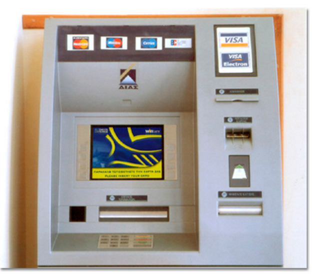
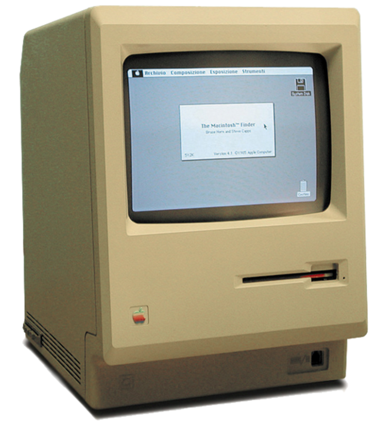
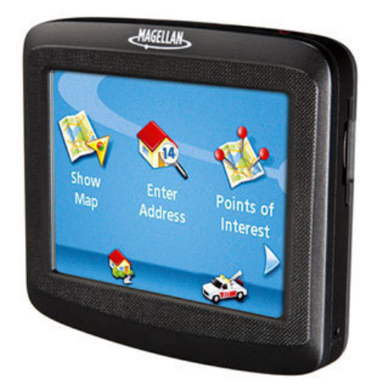
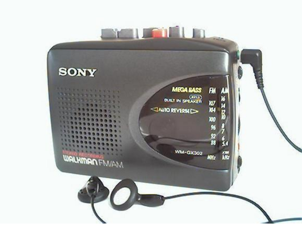

## Rozwiązania informatyczne, które zmieniły świat.

#### Bankomat (1963)
Pierwszy podłączony do sieci bankomat. Wyobraźcie sobie jakie byłoby bez nich życie.

#### Telefon komórkowy (1973)
Możliwość rozmowy niemalże z każdego miejsca na odległość to dopiero rewolucja. Umożliwiał to dobrze nam już znany telefon komórkowy. Pierwszy telefon wprowadziła Motorola. DynaTAC ważył 0,8kg i miał wymiar cegły.
![tel][tel.png]

#### Macintosh (1984)
Pierwszy komputer, który stał się standardem na przyszłość. Rewolucja w interakcji z komputerem, wygodny okienkowy interfejs.

#### Magellan - Nawigacja GPS (1989)

Pierwsze satelity, które pomagały ustalić lokalizację pojawiły się między 1989, a 1994. Za to piersze przenośne urządznie do nawigowania pojawiło się w 1989 roku. Dziś niemal każdy korzysta z nawigacji.

#### Walkman (1979)
Walkman - muzyka, która jest z Tobą wszędzie. Pierwszy raz zaprezentowany przez Sony w 1979 roku.

