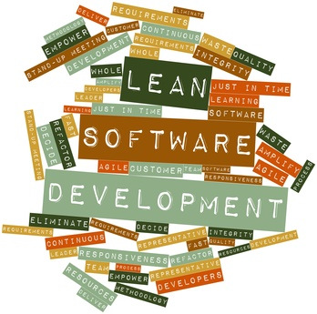

# Inne metodyki zwinne

## Lean software development
Jest to zastosowanie koncepcjii "lean management" w produkcji oprogramowania. Term "lean software development" pierwszy raz pojawił się w książce Mary Poppendieck i Tom'a Poppendieck.

Lean development można opisać siedmioma zasadami.

#### Eliminate waste
Wszystko co nie dodaje wartości do produktu jest marnotrawstwem.

#### Amplify learning
W miarę tworzenia oprogramowania zdobywamy coraz więcej informacji odnośnie projektu. Zamiast dopisywać coraz więcej do dokumetacji lub dokładnie planować kolejne posunięcia, nowe idee mogą być wypróbowane poprzez pisanie kodu.
 Proces zbierania wymagań możę być usprawniony poprzez częste iteracje, a każda z nich może być konsultowana z użytkownikiem końcowym.

#### Decide as late as possible
Wytwarzanie oprogramowania zawsze wiąże się z różnymi niepewnościami. Zamiast podejmować decyzje na podstawie zasłyszanych opini lub wątpliwych przesłanek, lepiej poczekać z decyzją tak długo jak tylko się da. Wtedy na pewno będziemy dysponowali nie mniejszą wiedzą, a być może decyzja zostanie podjęta na podstawie faktów.

#### Deliver as fast as possible
Im szybciej końcowy produkt zostanie wypuszczony (bez większych defektów) tym szybicej otrzymamy feedback, który zostanie wykorzystany w kolejnej wersji produktu.Im krótsze iteracje, tym lepsza komunikacja między zespołem i zespół szybciej się uczy.
Szybkość zapewnia, że zmienne potrzeby klientów zostaną prędzej zaspokojone.

#### Empower the team
Tradycyjnie kierownik/menadżer mówi pracownikowi jak ma wykonywać pracę. W lean development role są odwrócone. Kierownicy uczą się słuchać developerów, tak aby Ci mogli podpowiedzieć co można zmienić lub usprawnić. Jest to zgodne z zasadą Agile "Znajdź dobrych ludzi i pozwól im wykonywać ich własną pracę"

#### Build integrity
Często firma uważa, że wytworzyła rewelacyjny produkt, a klient ma odmienne zdanie. Klient powinnien wiedzieć ogólnie jak produkt jest reklamowany, dostarczany, wdrażany, dostępny, jak łatwo go używać, jak dobrze rozwiązuje problem, jego cenę.
Oznacza to, że komponenty systemu powinny dobrze działać ze sobą ogólnie jako całość np zachowywać balans między łatwością utrzymania i rozbudowy, a wydajnością, a użytecznością. Można to osiągnąc próbując zrozumieć i od razu rozwiązać domenę problemu, zamiast rozwiązywać problem kawałek po kawałku.

#### See the whole
Defekty w systemach potrafią się nawrastwiać i rozrastać wraz z coraz dalszym postępem w rozwoju produktu. Filozofia "lean development" każe usprawniać całość jako wartość, a nie konkretne podzespoły lub indywidualności. Najważniejsze jest, aby widzieć cały projekt w szerszej perspektywie i nie zamykać się tylko na problemy i potrzeby własnego podzespołu.

#### Zakończenie

Motto lean software development to "Think big, act small, fail fast; learn rapidly", czyli po polsku "Myśl na wielką skalę, działaj pomału, potykaj się często; ucz się szybko"
